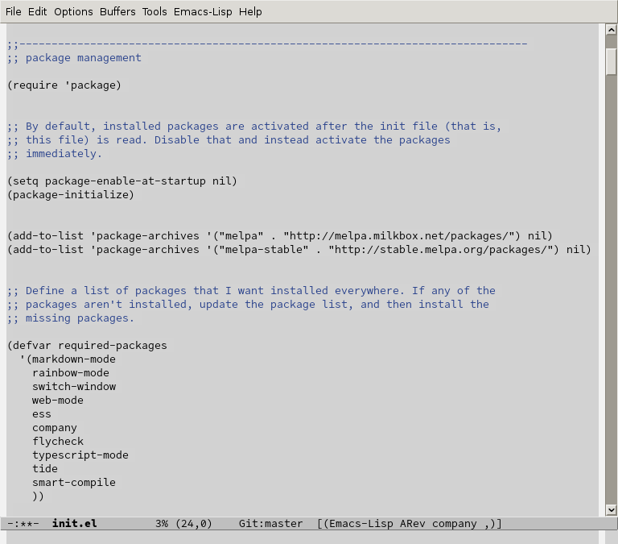

# commentator theme for Emacs

`commentator` is a minimalist theme designed to avoid the distracting rainbow of colors that many themes produce.

Among font-lock faces, comments are the only syntactic element distinguished with a different color. Everything else is displayed in a common foreground color. For non-font-lock faces, minimalism is a guiding principle but won't be as strictly enforced. Faces created by specific packages are left at their defaults unless I've used the packages and found the defaults to be at odds with the goals of this theme.



## Installation

`commentator` isn't on MELPA yet, so you must install it manually. First save `commentator-theme.el` somewhere, let's say `~/.emacs.d/themes/commentator-theme.el`. Then add the following to your init file:

```
(add-to-list 'custom-theme-load-path (concat user-emacs-directory "themes"))
(load-theme 'commentator t)
```
